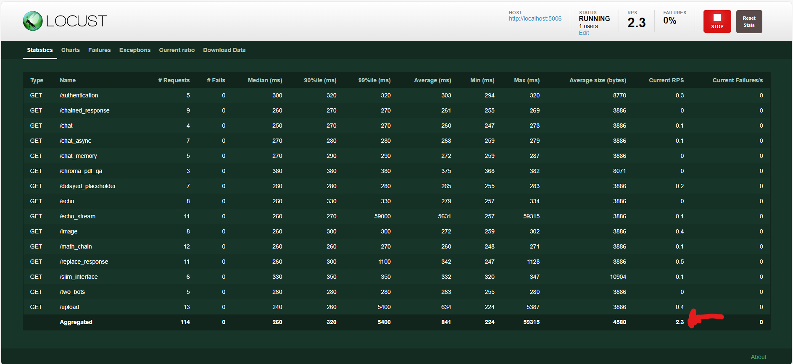

# Development

**Welcome. Thanks for your interest in Panel-Chat-Examples ❤️**

You can contribute in many ways, for example, by

- Giving our project a ⭐ on [Github](https://github.com/holoviz-topics/panel-chat-examples).
- Sharing knowledge about Panel-Chat-Examples on social media.
- Contributing very clear and easily reproducible [Bug Reports or Feature Requests](https://github.com/holoviz-topics/panel-chat-examples/issues).
- Improving our README, docs and developer infrastructure.
- Improving our collection of [examples](docs/examples).

Before you start contributing to our code base or documentation, please make sure your contribution is well described and discussed in a [Github Issue](https://github.com/holoviz-topics/panel-chat-examples/issues).

If you need help to get started, please reach out via [Discord](https://discord.gg/rb6gPXbdAr).

## Getting Installed

Start by cloning the repository

```bash
git clone https://github.com/holoviz-topics/panel-chat-examples
cd panel-chat-examples
```

If you are not a core contributor you will have to work with your own fork too. See the Github [Fork a Repo](https://docs.github.com/en/get-started/quickstart/fork-a-repo) guide for more details.

We use [Hatch](https://hatch.pypa.io/latest/install/) to manage the development environment and production build.

Please ensure it's installed on your system with

```bash
pip install hatch
```

Please ensure [Playwright](https://playwright.dev/python/) browsers are installed

```bash
hatch run playwright install
```

The first time `hatch run ...` is run, it will install the required dependencies.

## Format, lint and type check the code

Execute the following command to apply autoformatting, linting and check typing:

```bash
hatch run lint
```

## Run all tests

You can run all the tests with:

```bash
hatch run test
```

## Run UI tests

To run the Playwright tests in *headed* mode (i.e. show the browser) you can run

```bash
hatch run pytest -m ui --headed
```

You can take screenshots via

```bash
SCREENSHOT=true hatch run pytest -m ui --headed
```

The screenshots can be found in [tests/ui/screenshots](tests/ui/screenshots)

## Run Load tests

To ensure the apps can be deployed for example to Hugging Face spaces we need them to load fast.
We can test the loading time with [Locust](https://docs.locust.io/en/stable/index.html).

First you need to serve the examples

```bash
hatch run panel-serve
```

Then you should run

```bash
hatch run loadtest
```

Finally you can open [http://localhost:8089/](http://localhost:8089/) and click "Start swarming"

You should make sure the RPS (Request per seconds) stay above 1. In the image below its 2.3.



## Serve the documentation

You can serve the Mkdocs documentation with livereload via:

```bash
hatch run docs-serve
```

It'll automatically watch for changes in your code.

## Publish a new version

You can bump the version, create a commit and associated tag with one command:

```bash
hatch version patch
```

```bash
hatch version minor
```

```bash
hatch version major
```

Your default Git text editor will open so you can add information about the release.

When you push the tag on GitHub, the workflow will automatically publish it on PyPi and a GitHub release will be created as draft.
